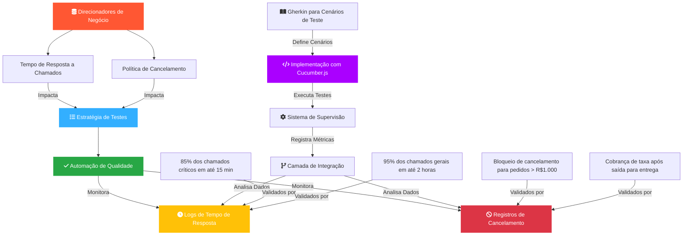

# Business Drivers - Automated Quality Control

## Resumo
Este documento apresenta uma visualização estruturada dos drivers de negócio para a automação de qualidade na Rappi. Inclui um diagrama **Mermaid** ilustrando as dependências chave, bem como uma descrição detalhada da implementação dos testes automatizados.

## Drivers de Negócio

### DN1: Tempo de Resposta para Chamados
- **85% dos casos críticos** devem ser respondidos **em até 15 minutos**.
- **95% dos chamados gerais** devem ser respondidos **em até 2 horas**.

### DN4: Cancelamento de Pedidos
- **Pedidos acima de R$1,000** não podem ser cancelados.
- Uma **taxa de cancelamento** é aplicada se um pedido é cancelado **após a saída para entrega**.

## Implementação dos Testes

### Estrutura do Projeto
```
.
├── gherkin-scenarios/           # Cenários de teste em Gherkin
│   ├── dn1-response-time.feature
│   └── dn4-order-cancellation.feature
├── test-implementation/         # Implementação dos testes
│   └── step-definitions/
│       ├── dn1-response-time.steps.js
│       └── dn4-order-cancellation.steps.js
├── cucumber.js                  # Configuração do Cucumber
└── package.json                 # Dependências e scripts
```

### Tecnologias Utilizadas
- **Node.js** - Ambiente de execução
- **Cucumber.js** - Framework de testes BDD
- **Gherkin** - Linguagem de especificação de testes
- **Assert** - Biblioteca de asserções

### Cenários de Teste

#### DN1: Tempo de Resposta
```gherkin
Scenario: Atendimento de casos críticos em até 15 minutos
  Given um cliente abre um chamado crítico
  When o chamado é registrado no sistema
  Then um agente deve ser atribuído em até 15 minutos
  And o tempo de resposta deve ser registrado
```

#### DN4: Cancelamento de Pedidos
```gherkin
Scenario: Bloqueio de cancelamento para pedidos acima de R$1.000
  Given um pedido com valor 1500
  When o cliente tenta cancelar o pedido
  Then o sistema deve bloquear o cancelamento
```

### Como Executar os Testes

1. **Instalação das Dependências**
   ```bash
   npm install
   ```

2. **Execução dos Testes**
   - Execução básica:
     ```bash
     npm test
     ```
   - Gerar relatório HTML:
     ```bash
     npm run test:report
     ```

### Relatórios
- Os relatórios são gerados em HTML após a execução dos testes
- Localização: `cucumber-report.html`
- Contém informações detalhadas sobre:
  - Cenários executados
  - Passos bem-sucedidos/falhos
  - Tempo de execução
  - Estatísticas de cobertura

## Diagrama Mermaid


